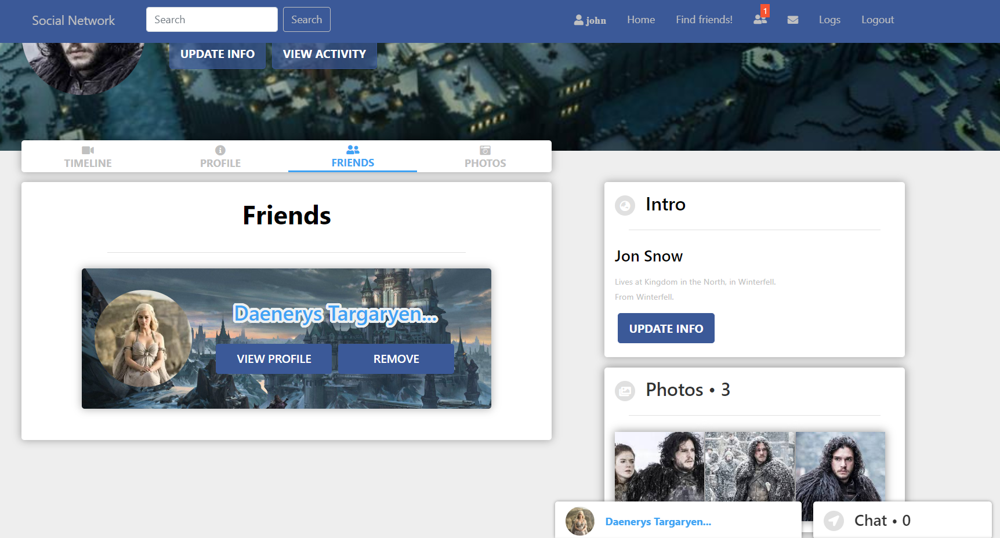

# k8s-Social-Network

In this project we will deploy a Stateful app ([Social-Network](https://github.com/kostadinlambov/Social-Network/)) built with Spring Boot, MySql, and React on Kubernetes. We’ll use a local minikube cluster to deploy the application.

The project contains three deployment files:
- mysql-deployment.yaml - deploys the MySql-database
- social-network-server.yaml - deploys the server of the app
- social-network-client.yaml - deploys the client of the app


## Requirements

1. Install [kubectl](https://kubernetes.io/docs/tasks/tools/install-kubectl/)

2. Install [minikube](https://kubernetes.io/docs/tasks/tools/install-minikube/)

3. In order to be able to save `Photos` you should sign up to [Cloudinary](https://cloudinary.com/)

## Deploying Mysql on Kubernetes using PersistentVolume and Secrets

### Starting a Minikube cluster
```bash
$ minikube start
```

### Creating the secrets

Create the secrets manually:

```bash
$ kubectl create secret generic mysql-root-pass --from-literal=password=root

$ kubectl create secret generic mysql-user-pass --from-literal=username=root --from-literal=password=root

$ kubectl create secret generic mysql-db-url --from-literal=database=social_network --from-literal=url="jdbc:mysql://social-network-mysql:3306/social_network?useSSL=false&createDatabaseIfNotExist=true&serverTimezone=UTC"

$ kubectl create secret generic cloudinary-credentials --from-literal=cloud-name=<enter_your_cloud_name> --from-literal=api-key=<enter_your_api_key> --from-literal=api-secret=<enter_your_api_secret>
```

Get all secrets:

```bash
$ kubectl get secrets
```
Get more information about a secret:

```bash
$ kubectl describe secrets mysql-user-pass
```

### Deploying MySQL

To deploy the database type:

```bash
$ kubectl apply -f deployments/mysql-deployment.yaml
```
You can check all the resources created in the cluster using the following commands:

```bash
$ kubectl get persistentvolumes

$ kubectl get persistentvolumeclaims

$ kubectl get services

$ kubectl get deployments
```

### Logging into the MySQL pod

You can get the MySQL pod and use `kubectl exec` command to login to the Pod

```bash
$ kubectl get pods
NAME                                        READY   STATUS    RESTARTS   AGE
social-network-app-mysql-67cf984757-9pjs6   1/1     Running   0          6m1s

$ kubectl exec -it social-network-app-mysql-67cf984757-9pjs6 -- /bin/bash
root@social-network-app-mysql-67cf984757-9pjs6:/#
```

## Deploying the Spring Boot app on Kubernetes

Apply the manifest file to create the resources:

```bash
$ kubectl apply -f deployments/social-network-server.yaml
```

You can check the created Pods like this:

```bash
$ kubectl get pods
NAME                                        READY   STATUS    RESTARTS   AGE
social-network-app-mysql-67cf984757-9pjs6   1/1     Running   0          31m
social-network-server-756dc94cf6-b2ghs      1/1     Running   0          111s
```

## Deploying the React app on Kubernetes

Apply the manifest file to deploy the frontend:

```bash
$ kubectl apply -f deployments/social-network-client.yaml
```

## Open the application:

You need to map `localhost:8000` to port `8000` on the backend service:

```bash
kubectl port-forward service/social-network-server 8000:8000
```
Type the following command to open the frontend service in the default browser:

```bash
minikube service social-network-client
```

## App screenshots

1. **Home Page**

 

2. **Friends Page**

 

3. **Photos Page**

 